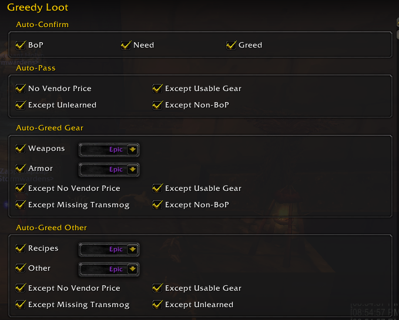

# Greedy Loot

A World of Warcraft Classic MoP addon that automates loot roll confirmations and adds auto-greeding/passing based on set rules.

**Creator:** Mugafo  
**Repository:** [Greedy Loot](https://github.com/Mugafo/wow-addon-greedyloot)

## Description

Greedy Loot handles loot roll confirmations and auto-greeding/passing on items based on your preferences. I once had an addon that did auto-confirmation back when I played retail in Wotlk/Cata/MoP and wanted something similiar but with a little extra.

### Features

- **Auto-Confirm**: Automatically confirm BoP items, Need rolls, and Greed rolls
- **Smart Auto-Greed**: Intelligent decision-making based on item type, quality, and character needs
- **Auto-Pass**: Automatically pass on items with no vendor value (with exclusions)
- **Class-Aware Logic**: Considers your character's armor and weapon proficiencies
- **Quality Control**: Set maximum quality thresholds for each item type
- **Account-wide Settings**: All settings saved across your account

## Dependencies

### Required
- **Ace3**: For options system and addon framework

## Configuration

### Interface Options
Access via: `Interface Options → Greedy Loot` or `/gl`



#### Auto-Confirm
- **BoP**: Automatically confirm Bind on Pickup items when looting
- **Need**: Automatically confirm Need rolls
- **Greed**: Automatically confirm Greed rolls

#### Auto-Pass
- **No Vendor Price**: Automatically pass on items with no vendor sell value

**Pass Exclusions:**
- **Except Usable Gear**: Do not pass on items that are usable gear
- **Except Unlearned**: Do not pass on recipes that are not learned
- **Except Non-BoP**: Do not pass on non-BoP items

#### Auto-Greed Gear
- **Weapons**: Enable auto-greeding on weapons with quality threshold
- **Armor**: Enable auto-greeding on armor with quality threshold
- **Quality Thresholds**: Set maximum quality for auto-greeding (Uncommon to Legendary)

**Gear Exclusions:**
- **Except Non-BoP**: Don't auto-greed on non-BoP gear (can be sold or traded)
- **Except Usable Gear**: Only greed on gear that cannot be equipped by your character
- **Except No Vendor Price**: Don't auto-greed on items with no sell value
- **Except Missing Transmog**: Only greed on gear that is already collected for transmog

#### Auto-Greed Other
- **Recipes**: Enable auto-greeding on recipes with quality threshold
- **Other Items**: Enable auto-greeding on other items with quality threshold
- **Quality Thresholds**: Set maximum quality for auto-greeding

**Other Exclusions:**
- **Except No Vendor Price**: Don't greed on items with no vendor price
- **Except Usable Gear**: Don't greed on items that are usable gear
- **Except Missing Transmog**: Don't greed on items missing from your transmog collection
- **Except Unlearned**: Don't greed on recipes that are not learned

### Exclusion

Battle Pets are excluded from Auto-Greed/Pass

#### Debug
- **Print Details**: Enable detailed chat output for troubleshooting

## File Structure

```
GreedyLoot/
├── GreedyLoot.toc          # Addon metadata and load order
├── GreedyLoot.lua          # Core functionality and loot handling
├── GreedyOptions.lua       # Options system and Interface Options
```
